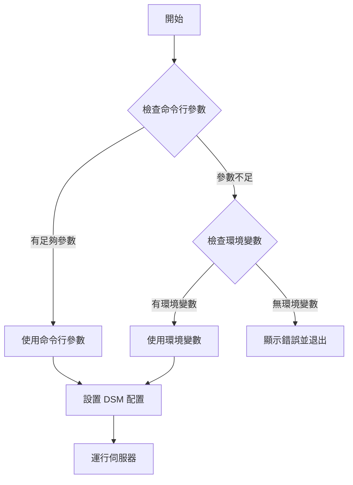

# Docker 環境變數支援計劃

## 問題描述

目前 MCP-SynoLink 在 Docker 環境中運行時，只能通過命令行參數傳遞 Synology DSM 的連接資訊（URL、用戶名、密碼和 API 版本）。這種方式不符合 Docker 的最佳實踐，也不便於在 CI/CD 環境中配置。

## 解決方案

修改應用程式，使其能夠同時支援命令行參數和環境變數。優先使用命令行參數，如果命令行參數不存在，則使用環境變數。

## 修改計劃

### 1. 修改 src/index.ts

需要修改應用程式的參數處理邏輯，使其能夠從環境變數中獲取參數：



具體修改如下：

```typescript
// 原始代碼
const args = process.argv.slice(2);
if (args.length < 3) {
  console.error(
    "Usage: synolink <synology-url> <username> <password> [api-version]"
  );
  console.error("Current arguments:", args);
  process.exit(1);
}

const [synoUrl, synoUsername, synoPassword] = args;
const apiVersion = args[3] || "7";
```

修改為：

```typescript
// 修改後的代碼
const args = process.argv.slice(2);
let synoUrl: string;
let synoUsername: string;
let synoPassword: string;
let apiVersion: string = "7";

// 優先使用命令行參數
if (args.length >= 3) {
  synoUrl = args[0];
  synoUsername = args[1];
  synoPassword = args[2];
  if (args[3]) {
    apiVersion = args[3];
  }
} else {
  // 如果命令行參數不足，嘗試使用環境變數
  synoUrl = process.env.SYNO_URL || "";
  synoUsername = process.env.SYNO_USERNAME || "";
  synoPassword = process.env.SYNO_PASSWORD || "";
  apiVersion = process.env.SYNO_API_VERSION || "7";

  // 檢查必要的環境變數是否存在
  if (!synoUrl || !synoUsername || !synoPassword) {
    console.error("Error: Missing required parameters");
    console.error(
      "Usage: synolink <synology-url> <username> <password> [api-version]"
    );
    console.error(
      "Or set environment variables: SYNO_URL, SYNO_USERNAME, SYNO_PASSWORD, SYNO_API_VERSION"
    );
    console.error("Current arguments:", args);
    process.exit(1);
  }
}

// 輸出使用的配置（不顯示密碼）
console.error(
  `Using Synology DSM at ${synoUrl} with user ${synoUsername} and API version ${apiVersion}`
);
```

### 2. 修改 Dockerfile

在 Dockerfile 中添加環境變數的定義：

```dockerfile
# 在 FROM node:22-alpine AS release 之後添加
FROM node:22-alpine AS release

WORKDIR /app

COPY --from=builder /app/dist /app/dist
COPY --from=builder /app/package.json /app/package.json
COPY --from=builder /app/package-lock.json /app/package-lock.json

ENV NODE_ENV=production
# 添加 Synology DSM 相關環境變數
ENV SYNO_URL=""
ENV SYNO_USERNAME=""
ENV SYNO_PASSWORD=""
ENV SYNO_API_VERSION="7"

RUN npm ci --omit=dev --ignore-scripts

RUN chmod +x /app/dist/index.js

# ENTRYPOINT 保持不變
ENTRYPOINT ["node", "/app/dist/index.js"]
```

### 3. 更新 README.md

在 README.md 中添加使用環境變數的說明：

````markdown
### Docker 環境變數

從版本 X.X.X 開始，SynoLink 支援通過環境變數設置 Synology DSM 的連接資訊。可以使用以下環境變數：

- `SYNO_URL`: Synology DSM 的 URL，例如 `https://your-synology-url:port`
- `SYNO_USERNAME`: Synology DSM 的用戶名
- `SYNO_PASSWORD`: Synology DSM 的密碼
- `SYNO_API_VERSION`: Synology DSM 的 API 版本，默認為 `7`

#### 使用 Docker 環境變數

```bash
docker run -i --rm \
  -e SYNO_URL="https://your-synology-url:port" \
  -e SYNO_USERNAME="your-username" \
  -e SYNO_PASSWORD="your-password" \
  -e SYNO_API_VERSION="7" \
  mcp/synolink
```
````

#### 使用 Docker Compose

```yaml
version: "3"
services:
  synolink:
    image: mcp/synolink
    environment:
      - SYNO_URL=https://your-synology-url:port
      - SYNO_USERNAME=your-username
      - SYNO_PASSWORD=your-password
      - SYNO_API_VERSION=7
```

#### 在 Claude Desktop 中使用

在 `claude_desktop_config.json` 中：

```json
{
  "mcpServers": {
    "synolink": {
      "command": "docker",
      "args": [
        "run",
        "-i",
        "--rm",
        "-e",
        "SYNO_URL=https://your-synology-url:port",
        "-e",
        "SYNO_USERNAME=your-username",
        "-e",
        "SYNO_PASSWORD=your-password",
        "mcp/synolink"
      ]
    }
  }
}
```

**注意**：命令行參數的優先級高於環境變數。如果同時提供了命令行參數和環境變數，將使用命令行參數。

````

## 測試計劃

1. **測試命令行參數方式**：
   ```bash
   node dist/index.js https://your-synology-url:port your-username your-password
````

2. **測試環境變數方式**：

   ```bash
   export SYNO_URL="https://your-synology-url:port"
   export SYNO_USERNAME="your-username"
   export SYNO_PASSWORD="your-password"
   node dist/index.js
   ```

3. **測試 Docker 環境變數方式**：

   ```bash
   docker run -i --rm \
     -e SYNO_URL="https://your-synology-url:port" \
     -e SYNO_USERNAME="your-username" \
     -e SYNO_PASSWORD="your-password" \
     mcp/synolink
   ```

4. **測試優先級**：
   ```bash
   export SYNO_URL="https://env-url:port"
   export SYNO_USERNAME="env-username"
   export SYNO_PASSWORD="env-password"
   node dist/index.js https://arg-url:port arg-username arg-password
   # 應該使用命令行參數的值
   ```

## 實施步驟

1. 修改 src/index.ts
2. 修改 Dockerfile
3. 更新 README.md
4. 構建並測試
5. 提交變更

## 預期結果

- 應用程式可以通過命令行參數或環境變數獲取 Synology DSM 的連接資訊
- 命令行參數的優先級高於環境變數
- Docker 用戶可以使用環境變數來配置應用程式
- 文檔清晰地說明了如何使用環境變數
